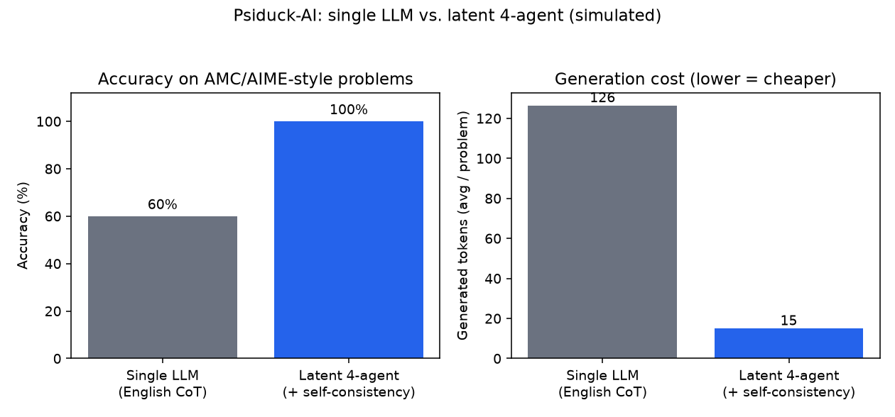

# Psiduck-AI

**Can four LLMs that talk to each other in *latent space* solve problems a single LLM can't — while using *less* generation compute?**

Psiduck-AI is a research scaffold for exactly that question. One open-weights
model is loaded **once** and shared by an encoder/controller, four specialist
delegates, and a decoder. The agents communicate by exchanging **latent vectors**
(pooled hidden states injected into the next stage as "soft tokens" via
`inputs_embeds`) — **not** English text. The only natural language ever
*generated* is the final integer answer.

```
 problem ─(embed)─▶ encode ──▶ context latent
                                   │
        ┌──────────┬──────────────┼───────────────┬───────────┐
        ▼          ▼              ▼                ▼
     algebra   counting     number-theory     geometry/verify     (4 delegates)
        │          │              │                │
        └──────────┴──────┬───────┴────────────────┘
                          ▼  (latent messages — zero English generated)
                    fuse + decode ──▶ final integer (short generation)
```

## Why this could be cheaper than one LLM

The expensive part of inference is **autoregressive generation**: every output
token is one sequential forward step. A single LLM solving a hard problem
"thinks out loud" in English for hundreds of tokens. Here, the agents exchange
fixed-size latent vectors (one forward pass each, **zero generated tokens**), and
only the final answer is decoded. So the multi-agent pipeline generates far
fewer tokens than an English chain-of-thought — see the `gen_tokens` column in
the demo output.

> **Honest scope.** This scaffold demonstrates the *mechanism* (latent AI-to-AI
> communication over a single shared latent space) and the *compute profile*
> (few generated tokens). It does **not** claim a small, untrained model beats a
> baseline on hard AIME problems — closing the accuracy gap is the research this
> scaffold is built to enable. Point `PSIDUCK_MODEL` at a heavier model on
> capable hardware to study accuracy at scale.

## Closing the accuracy gap: self-consistency

Because each latent decode only costs a handful of generated tokens, we can
afford to decode the final answer **multiple times and majority-vote** — classic
self-consistency — without coming anywhere near the token budget of a single
English chain-of-thought.

```bash
.venv/bin/python main.py --problem-index 3 --self-consistency 7
```

`--self-consistency N` (default `1`, i.e. off) runs the fused latent context
through the decoder `N` times and takes the majority answer (ties broken by the
smallest value). Enabling it needs `PSIDUCK_TEMPERATURE > 0` so the samples
actually differ. Even at `N=7`, the latent pipeline is still typically decoding
far fewer tokens in total than one 256-token English baseline run — this is how
`scripts/benchmark.py` narrows the accuracy gap in the chart below.

## Requirements

- Python 3.10+ (developed on 3.12), CPU is fine for the default 0.5B model
- Linux/macOS; `scripts/install.sh` creates a local virtualenv

## Setup

```bash
bash scripts/install.sh        # venv at .venv + deps + model prefetch into .hf_cache
```

This is exactly what the Cloud Agent environment runs on `install`
(`.cursor/environment.json`). Everything is installed **inside the repo** (`.venv`,
`.hf_cache`) so it persists on the workspace volume.

## Usage

Use the virtualenv's Python (or `source .venv/bin/activate` first):

```bash
.venv/bin/python main.py --list                 # list sample problems
.venv/bin/python main.py --problem-index 2       # compare baseline vs latent on one problem
.venv/bin/python main.py --all                   # run all samples + aggregate compute
.venv/bin/python main.py --problem "Find the remainder when 7^100 is divided by 1000."

.venv/bin/python scripts/demo_shared_latent.py   # show the shared latent space
```

Each run prints both approaches side by side:

| approach | answer | correct | gen_tokens | fwd_passes | wall_s |
| --- | --- | --- | --- | --- | --- |
| single-llm-english | ... | ... | ~256 | 0 | ... |
| latent-4-agent | ... | ... | ~a few | 5 | ... |

## Benchmark: single LLM vs. latent 4-agent

`scripts/benchmark.py` runs every sample AMC/AIME-style problem through both
approaches, writes `results/benchmark_results.csv`, and renders
`results/benchmark_chart.png` comparing accuracy and average generated tokens
per problem:

```bash
.venv/bin/python scripts/benchmark.py                   # simulated backbone, no downloads
.venv/bin/python scripts/benchmark.py --backbone real    # the actual shared HF model
.venv/bin/python scripts/benchmark.py --num-samples 7 --difficulties aime,amc
```



By default the benchmark (and CI) run against `SimulatedBackbone` so the chart
can be regenerated anywhere with no network access, no GPU, and no multi-GB
model download; pass `--backbone real` to benchmark the actual shared model
described above.

## Web demo

`webapp/` is a small Flask app that runs the same comparison live, in the
browser, with a real-time activity feed showing which agent is "on":

```bash
scripts/run_webapp.sh              # http://localhost:5000
```

It exposes the sample problems, streams each solver's steps and results over
Server-Sent Events (`/api/run/<problem_id>`), and has a "Re-run benchmark"
button that regenerates the chart above from the browser. The shared backbone
loads lazily on the first "Run" click, exactly like the CLI.

### Try it with no model download

Everything above — the CLI, the benchmark, and the web demo — works without
`torch`/`transformers` or any downloaded weights, via `psiduck/sim_backbone.py`'s
`SimulatedBackbone`: a dependency-free stand-in that implements the same
latent-communication protocol as `SharedModel`, actually solves the parseable
sample problems exactly, and simulates realistic generation latency so the
demo's shape (few tokens / more forward passes for the latent path) matches
what the real model is expected to show.

`psiduck/backbone_factory.py` picks automatically: it uses the real shared
model if it's importable **and already cached locally** (a filesystem check,
never a download attempt or a hang on a blocked network), and falls back to
`SimulatedBackbone` otherwise. Force one or the other with:

```bash
PSIDUCK_BACKBONE=simulated scripts/run_webapp.sh
PSIDUCK_BACKBONE=real      scripts/run_webapp.sh
```

## Configuration (environment variables)

| Variable | Default | Meaning |
| --- | --- | --- |
| `PSIDUCK_MODEL` | `Qwen/Qwen2.5-0.5B-Instruct` | Hugging Face model id (swap in a heavier model) |
| `PSIDUCK_BASELINE_MAX_NEW_TOKENS` | `256` | Baseline English chain-of-thought budget |
| `PSIDUCK_ANSWER_MAX_NEW_TOKENS` | `24` | Tokens the latent decoder may emit for the answer |
| `PSIDUCK_TEMPERATURE` | `0.0` | >0 enables sampling |
| `PSIDUCK_TORCH_THREADS` | `0` (auto) | CPU threads for torch |
| `PSIDUCK_BACKBONE` | `auto` | `auto` (real if cached, else simulated) / `real` / `simulated` — used by `webapp/` and `backbone_factory.py` |
| `HF_HOME` | `<repo>/.hf_cache` | Hugging Face cache location |

## Tests

```bash
.venv/bin/python -m pytest
```

Unit tests use a dependency-free `FakeBackbone` (no torch, no downloads) that
implements the same latent API and updates a real `ComputeMeter`, so they assert
both the orchestration wiring and the core thesis (latent communication
generates far fewer tokens than the English baseline). `SimulatedBackbone` and
the Flask web demo (`webapp/app.py`) each have their own test modules, so the
whole scaffold — CLI, benchmark, and web demo — is exercised without any model
download. CI (`.github/workflows/ci.yml`) runs the full suite on every push and
pull request.

## Project layout

```
psiduck/
  backbone.py         # SharedModel: one HF model + latent-communication primitives
  backbone_factory.py # picks real (if cached) vs SimulatedBackbone, no network hangs
  sim_backbone.py      # SimulatedBackbone: dependency-free stand-in for SharedModel
  pipeline.py         # LatentDelegationSolver, SingleModelSolver, compare()
  metrics.py          # ComputeMeter / ComputeStats (generated tokens, forward passes)
  roles.py            # the four delegate role tags (embedded, never generated)
  aime.py             # answer extraction + normalization to [0, 999]
  data.py             # sample problems (easy + AMC + AIME)
  config.py           # env-driven settings
  hf_env.py           # point HF cache into the repo
main.py                # CLI: baseline vs latent comparison (+ --self-consistency)
scripts/
  install.sh           # venv + deps + model prefetch
  prefetch_model.py     # downloads the configured model into .hf_cache
  demo_shared_latent.py # shows the shared latent space
  benchmark.py          # single-LLM vs latent-4-agent benchmark + chart
  run_webapp.sh          # launches the Flask web demo
webapp/
  app.py                # Flask app: SSE live comparison + benchmark endpoints
  static/index.html      # the demo page
results/                 # benchmark_results.csv + benchmark_chart.png (generated)
tests/                   # pytest suite (FakeBackbone, SimulatedBackbone, webapp)
.github/workflows/       # CI: runs the test suite on every push/PR
```
